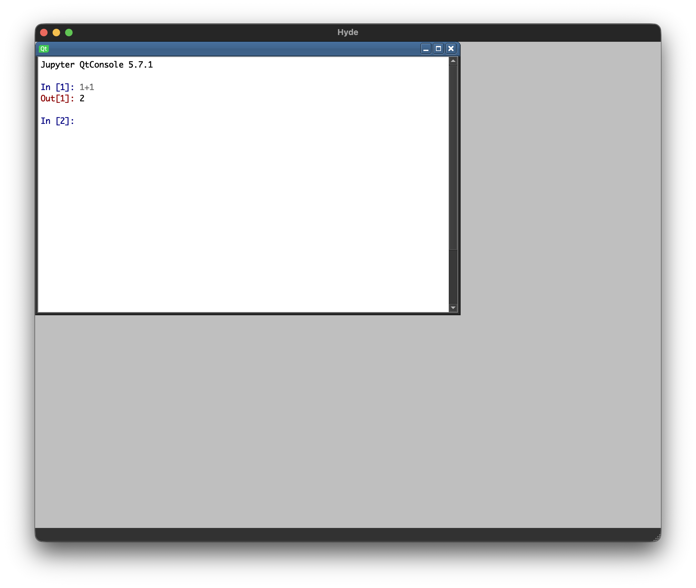

# Hyde Phase II, III, & IV Status

We have successfully built the core architectural skeleton of Hyde, transitioning from design philosophy to a fully functional GUI-plus-kernel infrastructure.

## Key Accomplishments

### 1. The 2-Process Architecture
Successfully isolated the GUI from execution logic using a direct managed hierarchy:
- **Main GUI Process**: A PyQt MDI shell with a `RichJupyterWidget` view, a GUI-owned `FileWatcher`, a plugin-managed lyse-compatible `ZMQServer`, and a lightweight runtime-helper thread for silent kernel work.
- **Jupyter Kernel (`spyder_kernels`)**: The authoritative source of truth, isolated for crash resiliency.

### 2. The 2-Lane IPC Strategy
Implemented clear separation of communication concerns:
- **Lane 1 (Control)**: `zprocess.ProcessTree` handles orchestration signals such as project-state notifications, table-open requests, and structured table-data responses.
- **Lane 2 (Data/Execution)**: Jupyter ZMQ handles visible execution, silent runtime-helper-owned execution, and Spyder namespace metadata. Hyde-owned structured relays such as table-open intents and table-data payloads travel through `ProcessTree` only where that narrow relay is a better fit than a new comm protocol.

### 3. Automated System Tests (Phase III)
Developed a headless integration suite (`tests/test_watchdog.py`) that:
- Launches the direct managed kernel child.
- Validates absolute path connection file linking.
- Executes isolated code strings via a `BlockingKernelClient`.
- Proves bidirectional ZMQ communication works without a GUI event loop.

### 4. Managed Process Tree & Observability
Established a managed lifecycle and real-time observability:
- **Managed Hierarchy**: Implemented a `GUI -> Kernel` tree using `zprocess` heartbeats to eliminate orphan processes. The `kernel_launcher.py` entrypoint starts Spyder's kernel in-process so the real kernel is the managed `ProcessTree` child rather than a separate `Popen` descendant.
- **Unified Logging**: Integrated `zlog` across all nodes, targeting standard suite `~/labscript_suite/logs/`.
- **Logging Window**: Added a dedicated MDI `OutputBox` for real-time stdout/stderr redirection of background processes.

### 5. Phase IV-A: Procedure Browser & Explicit Initialization
Established the foundation for a transparent, reproducible scientific environment:
- **Project Creation / Loading Flow**: Startup now accepts an existing `.hy` project path from `argv`, or prompts the user to open an existing project or create a new one. New projects are copied from a repo-stored template package.
- **"Explicit is Better than Implicit"**: The execution layer imports `procedures` from `procedures/__init__.py` in the kernel after project configuration, ensuring all imports (numpy, matplotlib) and backends are script-defined.
- **MDI Procedure Browser**: Added a native script browser for managing `.py` files within the project, featuring double-click integration with the system-default editor.
- **GUI-Owned Procedure Reload**: The GUI owns procedure-file monitoring through `labscript_utils.filewatcher.FileWatcher` and re-executes the canonical `procedures/__init__.py` load path through the runtime helper when watched `.py` files change.
- **Masked Background Execution**: Runtime-helper-driven `procedures/__init__.py` execution uses Jupyter `silent=True`, so backend-controlled execution does not emit visible `execute_input` or consume the user's prompt history.
- **Lyse-Compatible Remote Listener**: A first-party GUI plugin now owns a `ZMQServer` bound to the existing `ports.lyse` labconfig entry. Its handler normalizes incoming agnostic-path payloads and queues visible `remote(...)` execution through the runtime helper.
- **Procedure Browser Path Semantics**: The browser is rooted at `procedures/`; displayed entries are relative to that directory, not to the `.hy` project root.

### 6. Phase IV-C: Python Variables Initial Implementation
Established the first Hyde-native namespace browser:
- **Spyder-Based Namespace View**: Python Variables uses Spyder's namespace-view comm path rather than a Hyde-specific metadata tracker.
- **MDI Python Variables**: Added a dedicated MDI Python Variables window with a left-hand display control column and a main namespace list.
- **Filtering Semantics**: Implemented `Arrays`, `Variables`, and `Strings` filters, with `Arrays` covering numpy arrays and pandas DataFrames.
- **Info Pane Toggle**: The `Info` checkbox controls the visibility of the metadata pane.
- **Namespace Synchronization**: The browser requests an initial namespace snapshot after its own comm path is ready and refreshes after kernel execution and runtime-helper-owned procedure reload.
- **Supported Actions**: Implemented `Copy Python Expression` and `Delete Object` against the live kernel namespace.
- **Persistent Tool Windows**: MDI tool windows, including Python Variables, now hide on close rather than destroying their subwindow wrappers.

### 7. Phase IV-D: Table Initial Implementation
Established Hyde's first editable kernel-backed table workflow:
- **Public Table API**: `hyde.table(...)` now serves as a documented public Hyde helper for opening a table from live kernel objects.
- **MDI Table Window**: Added a table subwindow with a point column, one column per selected object, and a current-cell value strip.
- **New Table Dialog**: Added a `Windows -> New Table...` entry and a dialog that generates visible `hyde.table(...)` commands.
- **Python Variables Integration**: Python Variables' `Edit` and `Append to Table` actions now route table creation/appending through the same visible command path.
- **Kernel Relay Path**: Table-open requests and structured table-data payloads travel through the direct `ProcessTree` relay between the kernel and GUI.
- **Muted Cell Edits**: Table cell edits execute through the same command machinery as other Hyde commands, but are hidden from the visible command history to avoid console clutter.
- **Current Scope**: The implemented table path is limited to 1D numeric arrays; DataFrame tables, sorting, and persistence remain future work.
- **Recreation Macros**: Table close now offers to save a parameterized `@hyde.table` recreation macro into `procedures/__init__.py`, and `Windows -> Table Macros` is populated from the decorated registry after procedures reload.

### 8. Phase IV-E: Project Save/Load Initial Implementation
Established the first end-to-end `.hy` package persistence flow:
- **Explicit Hyde Commands**: Project persistence now uses public `hyde.save_project(...)` and `hyde.load_project(...)` helpers executed through visible command strings.
- **Kernel-State Persistence**: Saved kernel objects are written under `data/`, with `numpy.ndarray` using `.npy` and other saveable objects using pickle fallback.
- **Exclusion-Based Save Rules**: Saveable objects are selected by exclusion, including modules, packages, routines, classes/types, and interactive artifacts such as `In` / `Out`.
- **Manifest Tracking**: `manifest.toml` now records the saved-object registry, serializer, relative data path, and Python type name.
- **GUI Session Persistence**: The shell writes one `session.toml` file containing `main_window` state plus plugin-owned payloads gathered from each plugin's `get_save_data()`. Implemented plugin payloads include persistent tool-window state, Python Variables filter state, and open table descriptors.
- **Visible History Persistence**: `terminal/history.py` stores visible command history only; muted GUI micro-mutations are excluded.
- **File Menu Wiring**: `File -> Save` saves in place, `File -> Save As...` confirms before overwriting an existing non-empty project, writes a new `.hy` package, and switches Hyde to it, and project load restores kernel state after `procedures/__init__.py` runs.
- **Session Restore Policy**: GUI session restore reports malformed or missing `session.toml` files and continues with kernel-state restore already complete.
- **Plugin Boundary Completion**: First-party UI plugins are now discovered only from `hyde.user_interface.plugins`; the shell no longer injects the raw app object and table workspace ownership now lives in the table plugin rather than `HydeApp`.
- **Save Semantics**: In-place project saves rewrite the current saved state rather than preserving an older synchronized copy.
- **Project Switch Isolation**: Switching to a different `.hy` project resets the kernel namespace back to Hyde's clean baseline before the new project's procedures and saved state are loaded, so stale objects do not leak across projects.

### 9. Phase IV-B Figure Architecture Direction
The figure feature branch now has a settled architectural direction, even though the
full figure backend and window workflow are not implemented yet:
- **Live Figure Runtime Truth**: The live kernel matplotlib `Figure` is the runtime truth for draw, resize, export, and close behavior.
- **Kernel-Owned Figure IR**: First-class `@hyde.figure` figures carry a kernel-owned figure IR attached directly to the live figure. Here, "IR" means the figure feature's internal representation/internal state in the same sense as the existing Hyde state-to-Python path; this branch chooses kernel ownership specifically for figures.
- **First-Class vs Second-Class Figures**: All Hyde-backend figures may render in native MDI figure windows, but only `@hyde.figure` figures are first-class recreatable/editable figures in this deployment. Other live figures are second-class live-render-only windows for now.
- **Semantic Figure Edit Protocol**: Routine GUI figure edits travel as semantic Jupyter `comm` actions targeting the authoritative figure IR rather than as GUI-generated matplotlib source.
- **IR-Driven Macros**: Saved graph macros are generated from the authoritative figure IR and follow the same bounded `procedures/__init__.py` persistence pattern already used for table macros.

### 10. Shutdown and No-Project Behavior
Refined Hyde's explicit inert-state and quit handling:
- **Explicit No-Project State**: Startup without a CLI project enters a true no-project state with only `New Project`, `Load Project`, `Logging`, and `Quit` active.
- **Kernel-Authoritative Quit**: `File -> Quit` sends visible `hyde.quit()`, which signals both `ENTER_NO_PROJECT_STATE` and `QUIT_REQUESTED` from the kernel before the GUI follows the normal close path.
- **Terminal Quit Mapping**: In GUI mode, `quit`, `quit()`, `exit`, and `exit()` in the Python Terminal map to `hyde.quit()` instead of terminating the kernel directly.
- **Status-Bar Project Feedback**: Project operations report progress in the status bar rather than through a separate modal working dialog.
- **Forced Table Teardown**: Entering no-project state force-closes table windows without prompting to save recreation macros.

## Refinements & Bug Fixes
- **Path Derivation**: Implemented absolute module-based path derivation to prevent CWD-drift issues between the GUI and child processes.
- **Initialization Safeties**: Added a polling loop to ensure the Jupyter connection file exists and is ready before the GUI attempts to connect.
- **UI UX**: Standardized the Logging window size (80x40 equivalent) and ensured it behaves correctly within the MDI container.

## Active Major Bugs
- No currently documented major runtime/lifecycle bugs in this area.

## Documentation Updated
- `project_management/PLAN.md`: Marked Phase II architectural refinements as complete.
- `project_management/ARCHITECTURE.md`: Codified the finalized IPC model, plugin-only discovery namespace, and shell-vs-support package structure.
- `issues/FigureWindow_prd.md`: Revised to make the live kernel `Figure` the runtime truth and the kernel-owned figure IR the recreation/editability truth for first-class `@hyde.figure` figures.
- `project_management/HYDE.md`: Updated the product description so figure replayability is expressed in terms of kernel-owned figure IR and semantic figure edit actions.
- `project_management/specs/IPC_PROTOCOL.md`: Updated the high-level protocol contract so figure metadata and semantic figure edits travel over Jupyter `comm`, with first-class `@hyde.figure` figures owning kernel-side IR and second-class figures remaining live-render-only.
- `project_management/specs/logging_window/SPEC.md`: Added formal specifications for the new observability window.
- `project_management/specs/python_variables/SPEC.md`: Updated to match the implemented Hyde-native browser layout and supported action set.
- `project_management/specs/IPC_PROTOCOL.md`: Updated to document the actual `spyder_api` namespace-view comm path.
- `project_management/specs/table/SPEC.md` and `project_management/specs/new_table_dialog/SPEC.md`: Updated to match the implemented table workflow.
- `project_management/specs/project_save_load/SPEC.md`: Updated the `.hy` package save/load contract to reflect plugin-owned GUI session payloads gathered through `get_save_data()`.
- `project_management/specs/python_terminal/SPEC.md`: Updated to document GUI-mode rebinding of `quit` / `exit` to `hyde.quit()`.
- `2025_04_12_OPUS_EVALUATION.md`: Noted the transition toward `zprocess.Event` for future state notifications.
